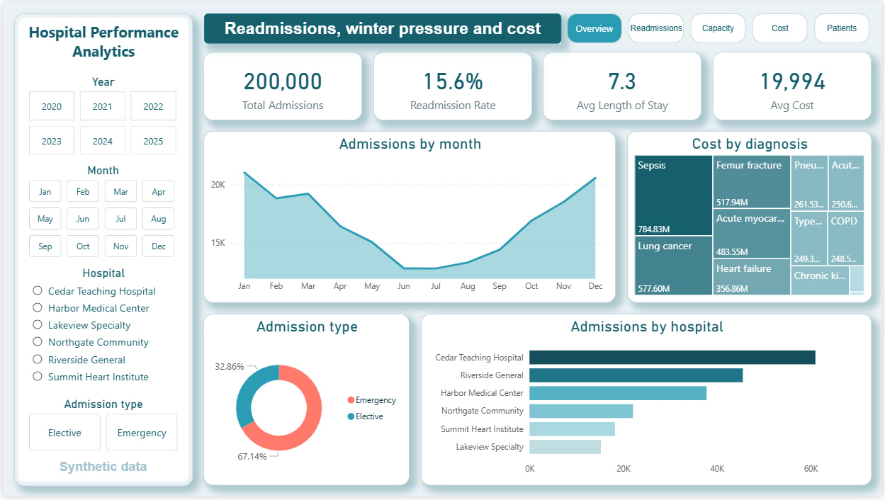
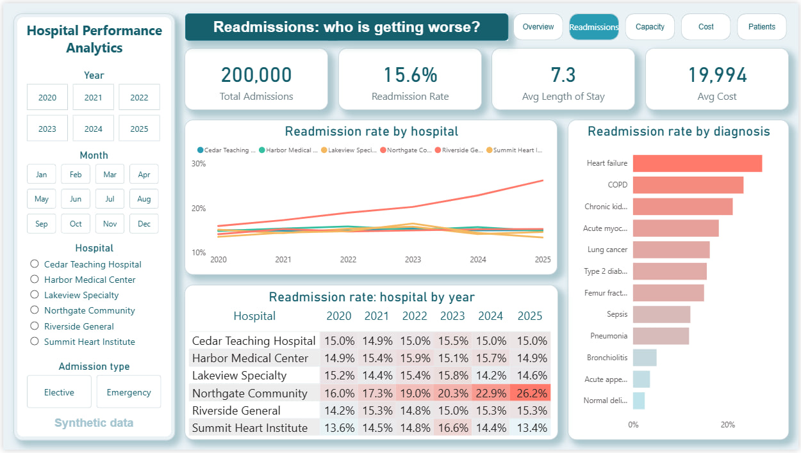
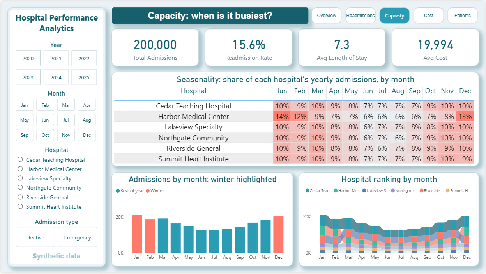
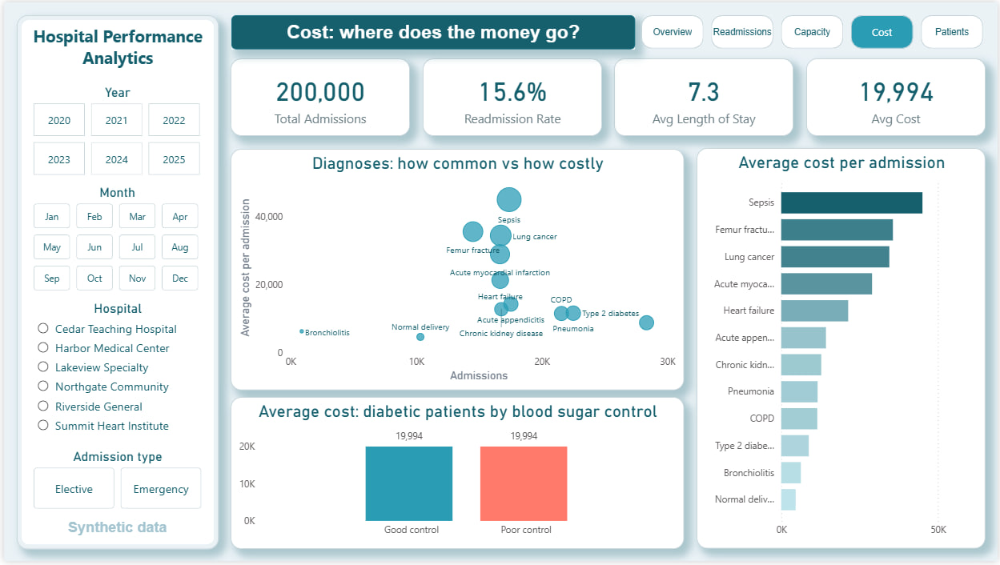
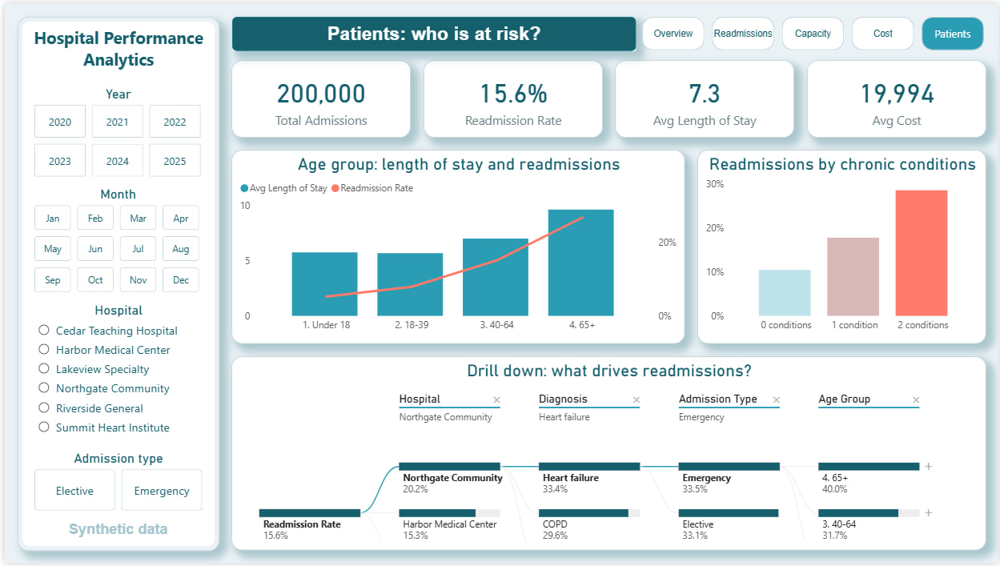

# Hospital Performance Analytics

An end-to-end analytics project on a multi-hospital system: synthetic patient data generated in **Python**, stored and queried in **SQL Server**, and presented in a 5-page interactive **Power BI** report.

**Main question:** Where is the hospital system losing efficiency and quality, and which patient groups and facilities drive the cost, the long stays, and the readmissions?

> **Note:** The data is fully synthetic, created for demonstration. It contains no real patient information. The relationships in it (for example, older patients staying longer) were built in deliberately, so the findings below show the analysis method, not real-world results.

## Key findings

1. **Northgate Community's readmission rate rose every year**, from 16.0% in 2020 to 26.2% in 2025, while the other five hospitals stayed between 13% and 17%.
2. **Harbor Medical Center has a winter surge.** Its winter admissions run 1.87x its other months, against 1.17 to 1.21 at every other hospital.
3. **Poorly controlled diabetes costs more.** Diabetic patients with HbA1c of 8 or higher cost about 38% more per admission (26,350 vs 19,097) and stay about 1.3 days longer.
4. **Sepsis is about 9% of admissions but about 20% of total cost.**
5. **Age and chronic conditions drive readmissions.** Patients 65 and over are readmitted 26.7% of the time, against 7.9% for ages 18 to 39. Patients with both diabetes and hypertension are readmitted 28.5% of the time, against 10.4% for patients with neither.

## Dashboard

| Overview | Readmissions |
|---|---|
|  |  |

| Capacity | Cost |
|---|---|
|  |  |

| Patients | |
|---|---|
|  | |

## The data

| Table | Rows | Description |
|---|---|---|
| `fact_admissions` | 200,000 | Admissions from 2020 to 2025: dates, length of stay, admission type, cost, outcome, 30-day readmission |
| `fact_lab_results` | 444,148 | HbA1c, creatinine, and CRP results per admission |
| `dim_patient` | 40,000 | Age, gender, smoking, diabetes, hypertension |
| `dim_hospital` | 6 | Hospital, region, type, beds |
| `dim_department` | 8 | Departments |
| `dim_diagnosis` | 12 | ICD-10 diagnoses with typical stay and cost |

## Tools and skills

- **Python** (pandas, NumPy): synthetic data generation with realistic relationships
- **SQL Server**: database design (star schema), joins, CTEs, `CASE`, aggregation
- **Power BI**: data modeling, DAX measures and calculated columns, 5 report pages, synced slicers, page navigation, decomposition tree

## Repository contents

```
Data_Generation.ipynb     Python notebook that generates the synthetic data
analysis_queries.sql               SQL queries behind each finding
hospital_analytics.pbix            the Power BI report
data/                              the six CSV files
screenshots/                       dashboard pages
```

## How to reproduce

1. Run `hospital_data_generation.ipynb` from top to bottom. It writes the CSVs to `data/`.
2. Import the six CSVs into a SQL Server database named `hospital_analytics`.
3. Run `analysis_queries.sql` to see the results behind each finding.
4. Open `hospital_analytics.pbix` in Power BI Desktop. The report stores its own copy of the data, so it opens without a database connection.

## Limitations

- The data is synthetic, so the patterns reflect how it was generated.
- The `smoker` field is included as a patient attribute but has no modeled effect on stays or readmissions.
- Costs are in generic cost units.

## Author

Nabila Eldib
